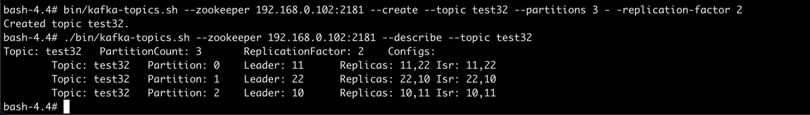

# 25#1
- 必做)搭建一个3节点Kafka集群，测试功能和性能;实现spring kafka下对kafka集群 的操作，将代码提交到github
  - [生产者](spring-kafka/src/main/java/com/example/springkafka/KafkaProducer.java)
  - [消费者](spring-kafka/src/main/java/com/example/springkafka/KafkaConsumer.java)
# kafka

- 启动三台kafka，broker id分别是10，11，22，
- 如上图，topic test32创建了3个partitions
- topic test32有3个分区(partition),分别是0，1，2这三个分区分别位于三台kafka上
  - 分片0，位于服务器11，12。11是leader
  - 分片1，位于服务器22，10。22是leader
  - 分片2，位于服务器10，11。10是leader
- 生产的消息路由到分片，首先写到leader，然后再从leader写到其他副本(replica)